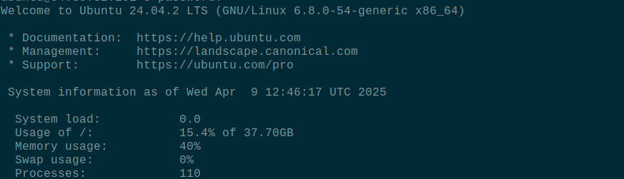
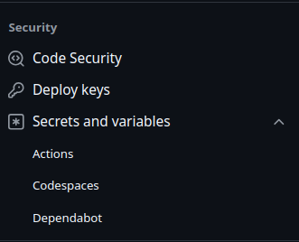
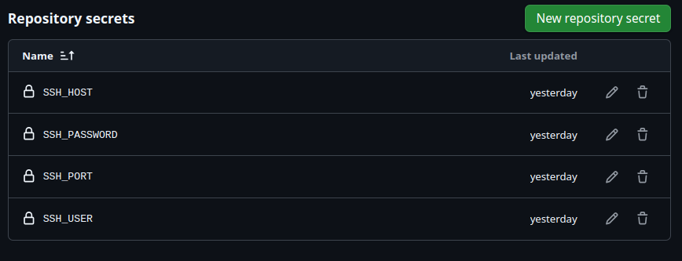
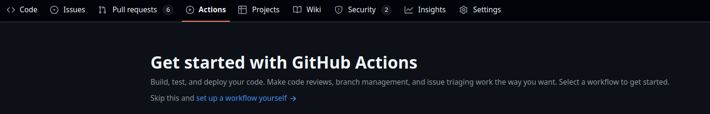
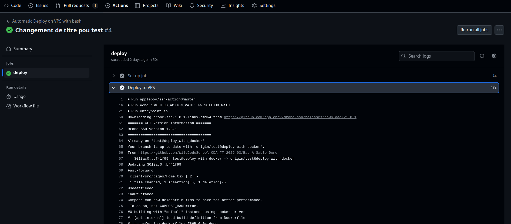

# Atelier Déploiement Nginx avec Node JS

## 1. Objectifs

Apprendre à automitiser le déployment d'une application sous Docker

- Docker
- Docker Compose
- Bash
- Github Action

## 2. Pré requis

- Un serveur configuré avec Nginx et le certificat SSL
- Connaissance docker
- Connaitre git, React et GraphQL et Apollo

Avant de commencer, tu vas devoir te connecter à ton VSP.
Puis, consultes ton fichier de configuration de `Nginx`

```bash
cat /etc/nginx/sites-available/default
```

Prends note :

- le port de ton client
- le port de ton api
- l'uri pour joindre ton api

Dans la suite de l'atelier, tu as le choix entre 2 possibilités :

- Adapter ta configuration `Nginx` à ton code
- Adapter ton code à la configuration (plus simple)

## 3. Explication et context

{: .alert-info }
Dans cet atelier, tu vas apprendre à déployer une application et à automatiser le processus (**Continous Deploiement**). Pour réaliser cela de manière la plus sûr possible, tu vas utiliser tes connaissances nouvellement apprises pour isoler tes couches de code via **Docker**. Puis, tu vas booster ton serveur pour que celui-ci puisse réaliser le `build` des containers plus facilement (C'est l'étape **Docker** qui coûte le plus cher en ressource). Pour terminer, tu vas écrire un script `bash` de déploiment, celui ci sera executé via une **action Github**.

💪 💪 💪So let' go!!!

## 4. Configuration Docker

{: .alert-warning }
Avant de travailler sur le déploiement, vérifie que ton code fonctionne correctement puis commite ton travail. Ensuite créer une branche spécifique pour ton déploiement. Cela permettra de ne pas casser ton code.

### 4.1 DockerFile dans la couche serveur (backend)

Dans ton éditeur de code préféré, tu vas ajouter un fichier `Dockerfile` à la racine de ton serveur. Configure celui-ci pour un déploiement (Le serveur doit passer en mode **_builder_**, à savoir compiler ton code `typescript` en `javascript`).

#### A- Configuration Projet

- Dans ton `package.json`, ajoute 2 commandes de script, `"build": "npx tsx"` et `"prod": "node ./build/index.js"`
- Dans ton `tsconfig.json`, active les clés `"rootDir": "/src"` et `"outDir": "/build"`
- Teste ta configuration, dans ton terminal

```bash
npm run build
```

Un dossier `build` devrait être créer sans erreur. En cas d'erreur, je te laisse regarder et corriger ton code (En cas de Big Problème, n'hésites pas à demander de l'aide)

#### B- Dockerfile

Dans ton fichier `Dockerfile`, ajoute les clés suivantes

- `FROM node:lts-alpine as PROD` : prépare l'OS de déploiement dans ton container
- `WORKDIR /app` : créé un dossier de stockage pour ton app
- `COPY *.json ./` : copie l'ensemble des fichiers de configuration au format json
- `RUN npm install` : installe les `node_modules` dans ton container
- `COPY src src` : copie le dossier src dans ton container dans un dossier du même nom

{: .alert-warning }
Si ton projet nécessite d'autres dossiers spécifiques pour les logs, les assets, les ressources publiques... hors `build`, il faut également les copier à ce moment-là.

- `RUN npm run build` : compile le code de `typescript` vers `javascript`
- `EXPOSE ${le port spécifique à ta configuration}`: expose le port de ton api
- `CMD ["npm", "run", "prod"]`: exécute le code de l'api 'run time'

Tu peux maintenant tester la configuration de manière isolée en lançant les commandes depuis ton dossier `serveur`

```bash
docker build -t api .
docker run -p <le_port_de_ta_configuration>:<le_port_de_ta_configuration> api
```

Si tout est ok, tu dois pouvoir accéder à ton `serveur` dans ton navigateur.

### 4.2 DockerFile dans la couche client (frontend)

#### A- Configuration vite

Pour commencer, tu vas devoir modifier la configuration de **Vite**. Par défaut, vite écoute et réponds uniquement à notre réseau `localhost`. Dans notre `vite.config.ts`, tu vas ajouter une clé "preview".
De plus, pour des raisons de sécurité, **Vite** bloque par défaut les requêtes venant de domaines non listés spécifiquement

```typescript
export default defineConfig({
  plugins: [react()],
  preview: {
    host: "0.0.0.0",
    allowedHosts: ["ton nom de domaine, sous domaine sans http://"],
  },
});
```

{: .alert-info }
Si tu veux développer ton code sous docker, il faudra également modifier ce fichier avec la clé "server".
De plus, selon ton choix, il est peut être utile de déclarer un port spécifique pour ton App en preview ([doc](https://vite.dev/config/server-options.html))

#### B- Dockerfile du client

Dans la même logique que le `Dockerfile` de ton **Serveur**, tu vas ajouter :

- `FROM node:lts-alpine as RUNNER` : prépare l'OS de déploiement dans ton container
- `WORKDIR /app` : créé un dossier de stockage pour ton app
- `COPY *.json ./` : copie l'ensemble des fichiers de configuration au format `json`
- `RUN npm install` : installe les `node_modules` dans ton container
- `COPY . .` : copie tous dans le dossier du container
- `RUN npm run build` : compile le code de `typescript` vers `javascript`
- `EXPOSE ${le port spécifique à ta configuration}`: expose le port de ton api
- `CMD ["npm", "run", "preview"]`: exécute le code de l'api 'run time'

Attention, ton `Dockerfile` demande une copie intégrale de ton dossier, ceci est possible en production car les **node_modules** ne sont pas intégrés à ton **Repository GitHub**. Sinon, tu aurais dû ajouter un fichier `.dockerignore`.

Pour finir, teste ton fichier `Dockerfile` en buildant ton client et en l'exécutant

```bash
docker build -t client .
docker run -p <le_port_de_ta_configuration>:<le_port_de_ta_configuration> client
```

### 4.3 Docker Compose pour orchestrer

Pour débuter cette partie, regarde si ton application FullStack fonctionne corrrectement en lançant les 2 containers séparement.
Il y a peut être des problèmes dans d'url de requête à corriger, des erreurs CORS...

Une fois que tu as noté et/ou résolu les erreurs, tu vas pouvoir passer à l'**Orchestration**

A la racine de ton projet, créer un fichier `docker-compose.yml`.
A l'intérieur, copie-colle le code suivant :

```yml
services:  // C'est la propriété de début
  api: // tag de ton image
    build: ./api // Source pour trouver le Dockerfile
    ports:
      - 3000:3000 // Binding de port entre la machine et le container
    command: npm run prod // Commande d'éxécution
    restart: always
    environment: // Déclaration des variables d'env si non sensible
      - CLIENT_URL=http://localhost:4280
      - PORT=8000

  client: // tag de ton image
    build: ./client // Source pour le Dockerfile
    command: npm run preview // Commande d'éxécution
    restart: always
     env_file: // Si besoin de variables issus d'un fichier d'env sur la machine
      - ./client/.env
    ports:
      - 4173:4173 // Binding de port entre la machine et le container

```

{: .alert-warning }
Les valeurs de port et de variables d'environnement sont à ajuster à ton projet. Ne laisse pas celles-ci par défaut.

Une fois cela fait, enregistre et teste en lançant la commande.

```bash
docker compose up --build
```

{: .alert-warning }
Si tu as ajouté un fichier de variable d'environment ou si ton fichier d'**orchestration** n'a pas le même nom, pense à ajuster la commande de lancement

Si tout se passe bien, pense à commiter ton code et à le mettre à jour en ligne sur cette branche

## 5. Configuration du serveur de déploiement

La configuration du code projet est maintenant faite. On va passer à la à la configation de ton VPS.
Commence par te connecter en VPS avec tes accès

```bash
ssh <user>@<host> -p <port>
```

### 5.1 Boost du serveur avec ajout de mémoire swap

Sur ton VPS, les ressources sont limitées. Tu peux avoir un aperçu de celle-ci lors de ta connexion.

{: .alert-info }
On voit dans l'illustration ci dessous, que j'utilise 40% de ma RAM mais peu de mes ressources en stockage (Hard Disk).
Dans ce cas, je peux basculer une partie de mon espace de stockage en mémoire vive. C'est un systeme de SWAP (mémoire tampon au format fichier). On peut voir cela comme une extension de la mémoire.



Comment procéder ? Exécute les commandes ci-dessous les unes après les autres

```bash
free -h # Affiche l'état de la mémoire du système (-h pour human-readable)
sudo fallocate -l 4G /swapfile # Créer un fichier vide de 4Giga
sudo chmod 600 /swapfile #Change les permissions du fichier pour qu’il ne soit accessible que par root.
sudo mkswap /swapfile # Formate le fichier pour qu’il devienne utilisable comme swap.
sudo swapon /swapfile #Active le fichier de swap.
sudo swapon --show # Affiche les espaces de swap actifs.
free -h # Affiche l'état de la mémoire du système (-h pour human-readable)
```

Super, ton VPS est maintenant booster en **Mémoire**. Cela sera particulièrement utile pour les `build` **Docker** qui en nécessite beaucoup.

{: .alert-warning }
Attention, cette méthode n'est pas magique non plus. Il est recommandé de respecter une certaine proportion entre la mémoire physique (RAM) et notre swap.

### 5.2 Mise à jour du projet ou clone

Maintenant,

- Vérifie que ton app tourne toujours sur ton navigateur (En cas de problème, la priorité est de relancer ton app avant de passer à la suite)
- Déplace toi dans le dossier de ton projet Github (`cd app/repo/...`)
- Met le à jour suivant la branche précédente (`git fetch --all && git switch <nom-de-la-branche>`)
- Renseigne tes variables d'environnement si besoin ???
- Execute ton code avec `pm2`.

A ce stade si tout est ok, tu devrais toujours accéder à ton app dans ton navigateur

- Stop les process tournant avec `pm2` [doc](https://pm2.keymetrics.io/docs/usage/process-management/)

### 5.3 Installation de Docker et lancement du docker compose

Pour installer **Docker** sur ton VPS, le mieux et le plus simple est de suivre la documentation officielle
👀👀👀 [doc](https://docs.docker.com/engine/install/ubuntu/#install-using-the-repository)

Si tout est bien configuré, tu as du accéder au container Hello World de `Docker`

Cool, pour éviter d'avoir à passer en mode `sudo` à chaque fois, tu peux configurer ton serveur
La documentation officielle de `Docker` t'explique comment faire 👀👀👀[doc](https://docs.docker.com/engine/install/linux-postinstall/#manage-docker-as-a-non-root-user)

Une fois cela fait, tu peux te déplacer dans ton dossier de projet et lancer :

```bash
docker compose up --build
```

Les containers devraient s'exécuter et si le `mapping` de tous tes `ports` est bon, ton application devrait de nouveau être accessible en ligne.
Si ce n'est pas le cas, vérifie :

{: .alert-warning }

- ta configuration nginx (`cat /etc/nginx/sites-available/default`)
- ton docker-compose (la propriété `ports`, le nom des variables d'environnement et leurs ports respectifs)
- ton fichier `index.ts` de ton api
- ton fichier `client.ts` de ton client

N'hésite pas à `push/pull` pour mettre à jour le code serveur. Pense à couper les containeurs et les `rebuilder` à chaque fois

### 5.5 Ecriture du script bash

Maintenant que tu as réussi à déployer ton application avec `Docker` à la main, essaie de noter toutes les étapes automatisables.
Ton objectif est de la reproduire dans un script `bash` qui sera exécuté.

Commence par créer et éditer un fichier `deploy.sh` (Place le dans le repo)

```bash
cd <path_vers_ton_dossier_de_projet /> # O se déplace a la racine du dossier de projet
git switch test@deploy_with_docker # On force la bascule sur notre branche de référence (main en cas de merge)
git pull # On met à jour la branche


docker stop $(docker ps -a -q) # On arrête tous les containers en cours

docker compose up --build -d # On relance l'orchestration des containers. Cette commande peut être ajustée si certains paramètres supplémentaires sont nécessaires (fichier d'env, nom du fichier, ...)

docker system prune -a -f # On supprime tous les résidus d'images non utilisé (Cela libère les ressources)
```

Pour vérifier que ton script fonctionne, éxécute les commandes ci dessous :

```bash
docker compose stop

cd <Chemin vers ton repo />
bash deploy.sh
```

Normalement, tu ne devrais pas avoir d'erreur dans ton terminal et ton application devrait toujours être disponible dans ton navigateur.

## 6. Github actions

**Dernière et Ultime étape** de notre projet de **Continious Deploiement**
Exécuter notre script de manière automatique lors d'un évenement GitHub (merge sur une branche, push sur une branche, ...)

### 6.1 Paramétrage de Github

Pour demander à Github d'éxécuter notre script, tu vas lui demander, étape par étape :

- Se connecter en **SSH** à ton serveur
- Lancer la commande d'éxécution de ton fichier

{: .alert-info }
Mais pour se connecter au **VPS**, je vais devoir renseigner mes informations de connexion. Ce n'est pas un peu dangereux cela ?

Pour palier à ce risque, **GitHub** à mis en place un système de clé secrète.
Rend toi tout de suite sur **Github**, sur la page d'accueil de ton `Repo`.

Normalement, tu es passé en mode **Administrateur** et tu as donc accès à un onglet **Settings**


{: .alert-warning }
Si ce n'est pas le cas, demande à ton formateur préféré (ou pas) de mettre à jour les droits d'utilisateur de ton repo

#### A- Settings

Dans l'onglet **Settings**, dans le menu à Gauche, clique sur **Secrets and variables** puis **actions** du sous menu **Security**.



#### B- Secrets and Variables

Tu vas devoir créer 4 variables, à chaque fois de la même façon.

- SSH_USER
- SSH_PORT
- SSH_HOST
- SSH_PASSWORD

Pour créer une nouvelle variable, dans l'onglet central 'Secrets', clique sur le gros bouton vert **New repository secret**. Ensuite :

- remplis le champs `Name` par le nom de la variable
- remplis le champs `secrets` par la valeur de la variable

{: .alert-warning }
Par mesure de sécurité, les valeurs entrées ne sont plus consultables ensuite. Vérifie bien tes saisies (Pas d'espace mort, minuscules, majuscules, ....)

A la fin, tu devrais avoir :



### 6.2 Mise en place du Workflow

Retourne dans ton éditeur de code.
A la racine de ton projet, créer un dossier `.github` avec à l'intérieur un autre dossier `workflows`. Attention, à respecter l'orthographe, elle est déterminante pour la plateforme **GitHub**.

A l'intérieur du dossier `workflows`, crée un fichier `deploy.yml`.
Ensuite, copie-colle le code ci dessous :

```yaml
name: Automatic Deploy on VPS with bash # Nom donné à notre action automatique, ce nom est arbitraire

on: # Listener d'evenements github *
  push:
    branches:
      - test@deploy_with_docker #Nom par defaut, a adapter à votre branche (Dans ce cas, chaque push sur la branche déclenchera l'acion. Ce critère peut bien évidement être adapter (Merge, ...))

jobs: # Liste des actions  à réaliser
  deploy: # Nom arbitraire de l'action spécifique
    runs-on: ubuntu-latest # OS pôur exécuter l'action
    steps: # Liste des étapes de la procédures
      - name: Deploy to VPS # Nom arbitraire de l'étape (Attention, ce nom sera un indicateur dans le terminal GitHub, soyons précis)
        uses: appleboy/ssh-action@master # Utilisation d'un service Tiers, ici un serive de connexion ssh **
        with:
          username: ${{ secrets.SSH_USER }} # Info nécessaire à la connexion SSH
          host: ${{ secrets.SSH_HOST }} # Info nécessaire à la connexion SSH
          password: ${{ secrets.SSH_PASSWORD }} # Info nécessaire à la connexion SSH
          port: ${{ secrets.SSH_PORT }} # Info nécessaire à la connexion SSH
          script: cd ./apps && bash ./deploy.sh # Commande éxécuter par le service une fois la connexion faite (A adapter à votre context)
```

{: .alert-info }

- \*Triggering Event (https://docs.github.com/en/actions/writing-workflows/choosing-when-your-workflow-runs/events-that-trigger-workflows)
- \*\*MarketPlace d'action GitHub (https://github.com/marketplace?type=actions)

Une fois cela fait, pense à commiter ton travail.
Patiente un peu avant de `push`

### 6.3 Vérification de l'action

Commence par accéder à la page de ton repo, et ouvre l'onglet **Actions**



Maintenant, retourne dans ton terminal et `push` ton code sur Github.
Retourne sur Github et rafraichit l'onglet.
Normalement, ton interface à changer et tu dois voir une ligne portant le nom de ton action (cf workflow).
Clique dessus, tu peux suivre l'éxécution de ton `script` et utiliser l'**Output** de l'interface Github pour debugger au besoin.



{: .alert-warning }
En cas de problème, n'hésite pas à demander de l'aide

Sinon, félicitation, tu viens de réaliser ton premier process de **Déploiement Continu** avec **Docker** et **Github Action**.
