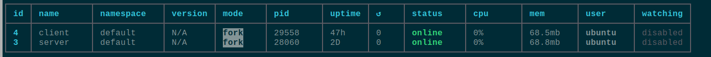

# Atelier Déploiement Nginx avec Node JS

## 1. Objectifs

Apprendre à déployer un site sous NodeJS avec Nginx

- Nginx et son reverse proxy
- Git
- NodeJS (React et Express)
- PM2
- SSL et let's encrypt

## 2. Pré requis

- Connaissance minimal en terminal Bash (Se déplacer dans les dossiers, afficher son arborescence, créer un fichier, éditer un fichier, ...)
- Connexion en ssh au serveur
- Connaitre git, React et express

## 3. Explication et context

### 3.1 Le serveur (machine physique) est souvent dédié à un service :

- Il peut recevoir et traité plusieurs requêtes en même temps.
- Il est spécialisé dans certaines tâches précises (stockage, calcul, hébergement).
- Il fonctionne en continu, 24h/24, 7j/7.
- Il est rarement manipulé directement et fonctionne souvent sans interface graphique (Connexion SSH).
- Sa puissance est optimisée pour gérer de multiples requêtes en même temps.

### 3.2 Le serveur web (Logiciel)

Pour fonctionner sur le web, un serveur a besoin d'un Serveur Web (Logiciel). Ce logiciel permet d'écouter les ports, par défaut pour le web :

- Port 80 pour HTTP (Non sécurisé)
- Port 443 pour HTTPS (Sécurisé).
  Si une demande (requête) arrive sur un port, le serveur web va prendre en charge la demande et y répondre en fonction des instructions que le développeur lui aura donné

Les 2 serveurs web les plus courants sont Nginx et Apache. Leurs grands missions sont donc :

- Distribuer des pages web : Il reçoit les requêtes HTTP/HTTPS des navigateurs et renvoie les fichiers HTML, CSS, JavaScript et médias demandés.
- Équilibrage de charge (Load Balancing) : Il peut répartir le trafic entre plusieurs serveurs d'application pour optimiser les performances et assurer une haute disponibilité.
- Reverse Proxy : Il agit comme intermédiaire entre les clients et vos serveurs d'applications (comme Node.js, PHP, Ruby), redirigeant les requêtes vers le bon service en arrière-plan.
- Mise en cache : Il stocke temporairement des copies des ressources fréquemment demandées pour accélérer les temps de réponse.
- Sécurité : Il filtre les requêtes malveillantes, limite les taux de connexion (rate limiting), et gère les certificats SSL/TLS pour les connexions sécurisées.
- Compression : Il peut compresser les données avant de les envoyer pour réduire la bande passante utilisée.
- Servir du contenu statique : Il est particulièrement efficace pour délivrer rapidement des fichiers qui ne changent pas (images, CSS, etc.).

Tu vas donc ajouter Nginx à ton serveur. Nginx est apprécié pour sa légèreté, sa rapidité et sa capacité à gérer un grand nombre de connexions simultanées, ce qui en fait un choix populaire pour les sites à fort trafic.

## 4. Installation des outils

Sur linux, avant toute installation, tu vas prendre le réflexe de mettre à jour le dictionnaire `apt`. C'est un peu la liste des packages possibles pour Linux/Ubuntu avec leur version.

```bash
sudo apt update
```

Puis tu vas mettre à jour les paquets à partir de ce nouveau dictionnaire.

```bash
sudo apt upgrade
```

### 4.1 Git

Le premier utilitaire dont tu vas avoir besoin est bien connu : **GIT**. Il va te permettre, un peu plus tard dans l'atelier de récupérer ton code sur ton repo GitHub ou celui de la Wild.

```bash
sudo apt install git
```

Puis vérifies que la CLI Git est correctement installée.

```bash
git --version
```

Git vient d'être installé en mode `sudo`(SuperAdim). Ton SuperAdmin est donc le propriétaire exclusif de `git` ou autrement dit, ton `user`ne peut faire exécuter `git`.
Pour y remédier, tu peux éxécuter les commandes : `sudo chown <ton_user>:<ton_user> /usr/bin/git`,
puis vérifier avec `ls -l /usr/bin/git`
{: .alert-warning }

### 4.2 Node

Le deuxième utilitaire à installer est ton runtime: **NodeJS** et son meilleur ami, le gestionnaire de package.

```bash
sudo apt install nodejs npm
```

Pour optimiser les ressources serveurs et éviter les doublons de packages npm, tu pourrais également installer `pnpm`.
{: .alert-warning }

Puis vérifies que l'installation s'est bien passée

```bash
node --version
npm --version
```

### 4.3 PM2

PM2 est un gestionnaire de processus qui va t'aider à gérer et à garder ton application en ligne. Si tu lançes un processus node (npm run dev) dans ton terminal, celui ci sera coupé, lorsque tu te déconnecteras. PM2 va te permettre de lancer ces processus en mode détaché (en arrière plan).

PM2 offre beaucoup d'autres possibilités également dans la gestion de tes logs, tes ressources [plus d'infos](https://pm2.keymetrics.io/docs/usage/quick-start/)

```bash
npm install pm2@latest -g
```

Ok, je crois que tu es bon pour les installation de base...
Il te restera **Let's encrypt**, mais plus tard...

## 5 Configuration du serveur web

### 5.1 Nginx

Pour commencer, tu vas maintenant installer le logiciel de serveur Web Nginx.

```bash
sudo apt install nginx
```

Le plus simple pour vérifier si tout s'est bien passé, est de regarder avec ton client d'API (bruno, postman, insomnia, etc.) si tu reçois bien un status(200) lorsque tu requêtes ton nom de domaine. (Passe en mode `raw` pour regarder le code `html`)

Tu ne peux pas tester pour le moment avec ton navigateur. La plupart des navigateurs, pour des raisons de sécurité, bloquent les requêtes en http (Il faut du https). Nous y reviendrons à la fin de l'atelier.
{: .alert-warning }

Mais d'où vient cette page web ?
{: .alert-info }
Par défaut, **_Nginx_** va placer le code à exécuter dans le dossier **_/var/www/html_**
Si tu t'y déplaces, tu verras qu'un fichier `index.nginx-debian.html` est présent. C'est la page d'accueil par défaut de Nginx.
Cela signifie que tout est ok et correctement installé.

Avant de continuer, nous avons encore un conflit de droit d'utilisateur.
En effet, l'installation de Nginx crée un nouvel utili spécifique `www-data`. Ton `user`n'a donc pas de droit d'écriture dans ses dossiers. Hors, tu vas devoir cloner ton projet chez lui (`www-data`).
{: .alert-warning }

AAAAAAAAAAAAAAHHH!!!! windows est tellement plus simple sans tout ses verrouillages.
Certes, mais ceci est mis en place pour des raisons de sécurité.

- Alors, ajoutes notre `user` au groupe `www-data` (on va être copains) : `sudo usermod -aG www-data $USER`
- Puis ajoutes ton user en propriétaire du dossier cible : `sudo chown -R $USER:www-data /var/www/html`
- Et enfin, appliques les bonnes permissions `sudo chmod -R 775 /var/www/html`

### 5.2 Déployer un site static

Pour commencer, vas dans ce fameux dossier `var/www/html` puis clones un projet static (HTML, CSS, JS).
Si tu n'en as pas sous le coude : `https://github.com/jujuck/Memorize.git`

```bash
git clone <ton_url_de_repo>
```

**_Normalement, tu n'as pas besoin d'éxécuter la commande en `sudo`. Si oui, il faudra revenir sur les 2 opération `git`et `nginx`de gestion de droit_**

Super!!!
Si tu vas sur ton client API et que tu ajoutes le nom de ton dossier à ton nom de domaine, tu devrais accéder à ton site web (Attention, le fichier racine doit être un **_index.html_**)
Exemple http://mondomain.dev/Memorize

### 5.3 Un peu de sécurité

Sans indication supplémentaire, **_Nginx_** expose donc le dossier **_/var/www/html_** et l'url nous permet d'accéder aux sous-dossiers et fichiers à l'intérieur.
Mais, ceci peut permettre également à une personne malveillante de l'explorer à sa guise.

Tu vas donc mettre un peu de configuration supplémentaire pour verrouiller tout cela.
La configuration principale de **_Nginx_** se situe dans `/etc/nginx`. On va y éditer le fichier `/sites-available/default`

```bash
sudo nano /etc/nginx/sites-available/default
```

Tu devrais y vois un code ressemblant à ceci

```yml
server {
    listen 80 default_server;
    listen [::]:80 default_server;

    # Chemin racine des fichiers du site web
    root /var/www/html;

    # Page d'index par défaut
    index index.html index.htm index.nginx-debian.html;

    # Nom du serveur (domaine ou IP)
    server_name _;

    location / {
        # Premier choix du fichier à renvoyer
        try_files $uri $uri/ =404;
    }

    # Exemple de configuration pour les erreurs 404
    # error_page 404 /custom_404.html;
    # location = /custom_404.html {
    #     root /var/www/html;
    #     internal;
    # }

    # Configuration pour PHP si PHP-FPM est utilisé
    # location ~ \.php$ {
    #     include snippets/fastcgi-php.conf;
    #     fastcgi_pass unix:/var/run/php/php7.4-fpm.sock;
    # }

    # Sécurité supplémentaire (interdire l'accès aux .htaccess)
    location ~ /\.ht {
        deny all;
    }

}

```

A la place de :

```yml
location / { # Premier choix du fichier à renvoyer
    try_files $uri $uri/ =404;
}
```

Insères le code ci dessous:

```yml
# Empêcher l'accès à la racine www/html
location / {
    root /var/www/html;
    deny all; # Bloque l'accès à tout sauf aux exceptions ci-dessous
}


# Active une route /memorize pour accéder à la ressource
location /memorize {
    alias /var/www/html/Memorize;
    try_files $uri $uri/ =404;
    autoindex on; # active la navigation dans les dossiers enfants (accès aux images et assets)
}
```

Puis recharges **_Nginx_** pour qu'il exécute ces nouvelles règles de configuration.

```bash
sudo systemctl reload nginx
```

Tests... Tu peux normalement accèder à `/memorize` mais plus à la racine `/` dans ton client API.

### 5.3 Passons au reverse proxy

Tu vas te servir du système de routing natif de Nginx pour orienter les requêtes entrantes sur le serveur vers un service spécifique. Actuellement, tu **_routes_** les requêtes `http://<nom_de_domain>/memorize` vers le dossier `/var/www/html/Memorize`

On va donc faire pareil, mais vers des **ports** du réseau local (localhost) de ta machine (ceux du client et de l'api).

#### Dans ton dossier `home`

Clone ton projet en utilisant **git** précedemment utilisé. Tu peux le faire en **_https_** car normalement, tu ne dois pas réaliser de développement en **_prod_** et n'auras donc **_jamais_** à faire de `push`.
Si besoin, charges la branche que tu souhaites déployer, sinon reste sur `main`

#### Configure ton projet

- Installation des dépendances
- Gestion des variables d'environnement si besoin

🙏🙏🙏 Derrière Nginx, nos 2 services **_client_** et **_api_** se retrouvent avec la même origine (Ton nom de domaine). tu n'as plus besoin de configurer de **_cors_**.
{: .alert-info }

#### Lances tes services client et server

**Pour le serveur**

```bash
cd api
pm2 start "npm run dev" --name server
```

**Pour le client**

```bash
npm run build
pm2 start "npm run preview" --name client
```

👀👀👀 En production, le port vite est 4173

**Vérification**

Pour rappel, `pm2` va lancer notre serveur en mode détaché. Si aucune erreur n'est indiqué dans le terminal, c'est que tout est bon.
Tu peux vérifier en lançant la commande :

```bash
pm2 ls
```



#### Mets à jour ta config Nginx pour orienter les réquêtes entrantes vers le bon service.

Pour cela, tu vas de nouveau éditer le fichier **sites-available/default**. Si tu as oublié la commande, pas de souci. Utilises la flèche vers le haut pour retrouver les anciennes commandes. Une fois le fichier en mode édition, remplaces le code insérer précedemment par celui ci dessous :

```yml
# Empêcher l'accès à la racine www/html sauf pour /memorize
#location / {
#       root /var/www/html;
#       deny all; # Bloque l'accès à tout sauf aux exceptions ci-dessous
#}

location / {
    proxy_pass http://localhost:4173; #Oriente les requetes vers la racine de Nginx vers le localhost:4173, notre client
    proxy_http_version 1.1;
    proxy_set_header Upgrade $http_upgrade;
    proxy_set_header Connection 'upgrade';
    proxy_set_header Host $host;
    proxy_cache_bypass $http_upgrade;
}

location /api {
    proxy_pass http://localhost:4000; #Oriente les requêtes vers la /api vers le localhost:4000. L'uri /api est conservé
    proxy_http_version 1.1;
    proxy_set_header Upgrade $http_upgrade;
    proxy_set_header Connection 'upgrade';
    proxy_set_header Host $host;
    proxy_cache_bypass $http_upgrade;
}

location /memorize {
    alias /var/www/html/Memorize;
    try_files $uri $uri/ =404;
    autoindex on; # Facultatif : affiche la liste des fichiers si index.html absent
}
```

👀👀👀 N'oublies pas de rechercher Nginx.
Normalement, si tu retournes sur ton Client API préféré et que tu cherches à accéder à la racine de ton nom de domaine, tu devrais accéder au code `html` de ton index.

Cool. Et maintenant, sécurises tout cela pour le voir dans le navigateur....

## 6. Let'encrypt et le certificat SSL

Voici le lien de la documentation officielle OVH pour en savoir plus sur le certificat SSL.
[Doc](https://help.ovhcloud.com/csm/en-vps-install-ssl-certificate?id=kb_article_view&sysparm_article=KB0066249)

### 6.2 - Installation de Certbot

Certbot est un outil permettant de gérer automatiquement les certificats **Let's Encrypt**. Suis les étapes ci-dessous pour installer Certbot.

```bash
sudo apt update
sudo apt install certbot
```

Vérifies que Certbot est correctement installé en exécutant la commande suivante :

```bash
certbot --version
```

Tu devrais voir la version de Certbot installée.

### 6.3 - Obtenir un certificat SSL avec Let's Encrypt

Installes le plugin Certbot pour Nginx :

```bash
sudo apt install python3-certbot-nginx -y
```

Généres le certificat SSL :

```bash
sudo certbot --nginx -d your_domain
```

Un certificat SSL est temporellement contraint. Ce qui veut dire, qu'il possède une date d'expiration (3ois, 6mois). Il faut donc le renouveller régulièrement.
{: .alert-info}

Certbot configurera automatiquement le certificat SSL et la redirection HTTPS. Vérifiez que votre site web est accessible en HTTPS.

Si tout s'est bien déroulé, tu devrais maintenant pouvoir accéder à ton app React dans ton navigateur avec toutes les données.
💪 Félicitations 💯💯💯
